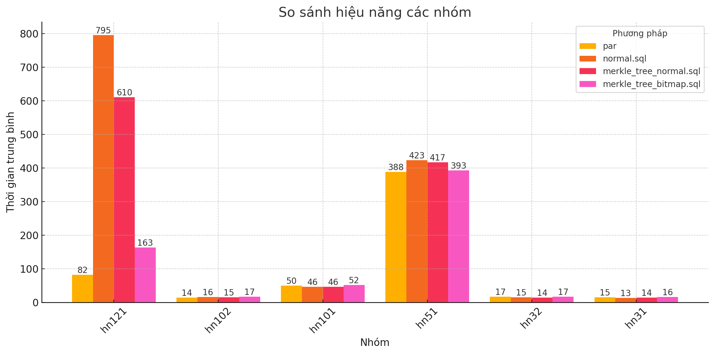

# Feature

- [x] Test Time To Response SQL Query
- [x] Stress Test SQL Query
- [x] Test the accurate of SQL Query

# REQUIMENT

- Golang

# BUILD

```bash
go build
```

# USAGE

1. Create file `config.json` from `config.template.json`
2. Create folder:

- `results`: Contain test results.
- `testcase`: Contain file .sql must be test.
- `sqlTest`: Contain file .sql to test testcase which have the name same together.

3. Run

```bash
./test-trans [ --mode ttl | stress | acc ] [--exe nor | par ]
```

- `ttl`: Time to response test
- `stress`: Stress test
- `acc`: Accurate test
- `nor`: Test 1-1 sql-trx.
- `par`: Test n-1 sql-trx. All queries which have same trx are put together in child folder of `results`

4. Use AI to generate diagram from json
   
